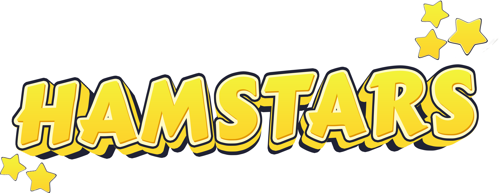

    

    <strong>⭐&nbsp;&nbsp;HAMSTARS&nbsp;&nbsp;⭐</strong> 
    Created by... <strong>H-Force&nbsp;&nbsp;🐹</strong> 
    <em>Winner of The Town One Artisan Award&nbsp;&nbsp;🎨</em>

  
    
    

## Overview

Compete with up to 4 friends as a hamster in this fast-paced peanut hoarding brawl. 

Created for the Town One Game Jam in May 2022.

## Features
- Play as a hamster
- Hop in a hamster ball and squash the competition
- The more peanuts held, the slower the hamster
- Store the most peanuts before time runs out to win

## Gamepad Controls
- Left Stick - Controls hamster
- Top button - Enter/Exit hamster ball
- Right button - Drop peanuts
- Bottom button - Jump

## Credits

### Assets

Music: [Quick Party Before the End of the World - Francesco D'Andrea](https://artlist.io/song/33738/quick-party-before-the-end-of-the-world)

Sounds sourced from: [Freesound](https://freesound.org/), [Soundsnap](https://www.soundsnap.com/), [Zapsplat](https://www.zapsplat.com/)
